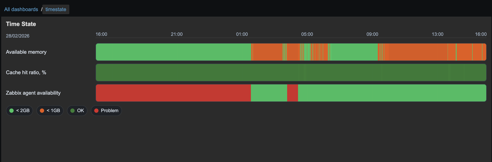
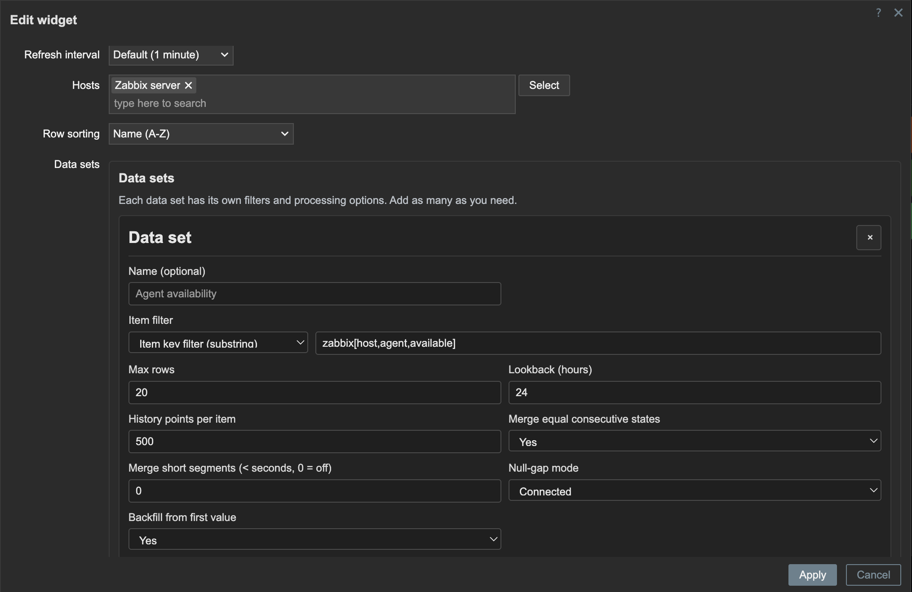

# Zabbix Time State Widget (7.x)

State timeline widget inspired by Grafana State Timeline.

## Features

- Multiple hosts.
- Global options:
  - `Name (A-Z)`
  - `Current status (Problem first)`
  - `Last change (most recent first)`
  - page size (pagination)
  - row height
  - line width
  - fill opacity
  - row grouping (`None` / `Host` / `Data set`)
  - groups collapsed by default
  - time axis tick interval
  - time axis label density
  - show grid lines (`Auto` / `On` / `Off`)
  - legend mode (`List` / `Table` / `Hidden`)
  - legend count and total duration toggles
  - show values in segments (`Auto` / `Always` / `Never`)
  - align values in segments (`Left` / `Center` / `Right`)
  - tooltip mode (`Single` / `All` / `Hidden`)
  - tooltip sort order
- Dataset-based configuration (add multiple datasets in one widget).
- Per-dataset options:
  - item filter mode (`Item key` or `Item name`) + filter value
  - lookback hours
  - max rows
  - history points per item
  - merge equal consecutive states
  - merge short segments threshold (seconds)
  - null-gap mode (`Disconnected` / `Connected`)
  - optional backfill from first value
  - advanced value mappings builder (type + condition + text + color)
  - live item suggestion popup while typing filters
  - matched items preview panel
- Null-gap behavior:
  - `Disconnected` = show no-data gaps for missing intervals.
  - `Connected` = extend neighboring states through missing intervals.
- Fallback deterministic colors for unmapped state values.

## Install

1. Place module directory in your Zabbix `ui/modules/` location.
2. Enable module in `Administration -> General -> Modules`.
3. Add widget `Time State` on a dashboard.

## Packaging

- Local build (for `dev` branch testing):
  - `./scripts/build-package.sh`
- Output file:
  - `dist/timestate-zabbix-v<version>.zip`
- CI build:
  - On every push to `main`, GitHub Actions workflow
    [`.github/workflows/build-package.yml`](/Users/patrik/git/zabbix-widget-timestate/.github/workflows/build-package.yml)
    builds and uploads the package as an artifact.

## Compatibility Note

- Primary target: Zabbix 7.0.
- Should also work on Zabbix 7.2 and 7.4.
- 7.2 and 7.4 are currently not actively tested or maintained.

## Notes

- Value mappings are configured per dataset via the edit-row builder (type + condition + text + color).
- Backend mapping syntax (for reference) supports:
  - `value:0=OK|#2E7D32`
  - `range:80..100=High|#C62828`
  - `regex:/^ERR.*/=Error|#C62828`
  - `special:null=No data|#607D8B`
- Color selection is done through the integrated swatch picker in mapping rows.

Parts of this software were generated using Codex. We do not guarantee the total accuracy, security, or stability of the generated code.
